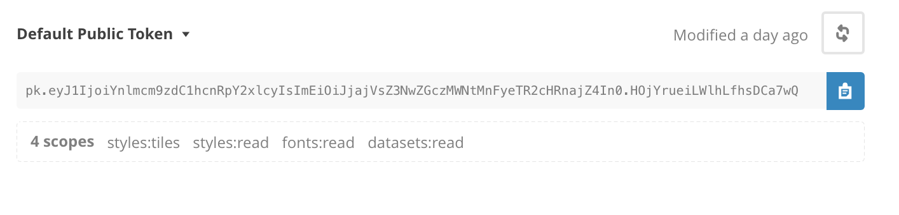
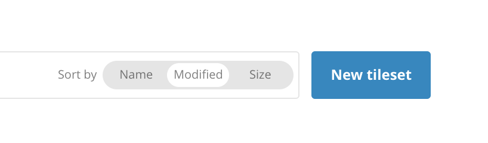
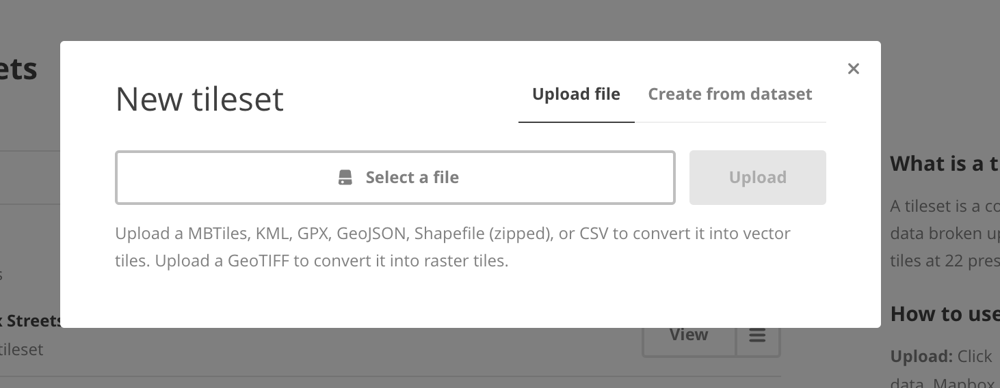
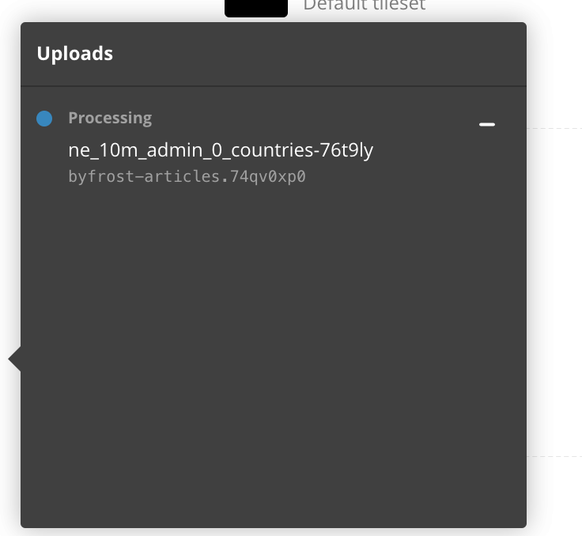
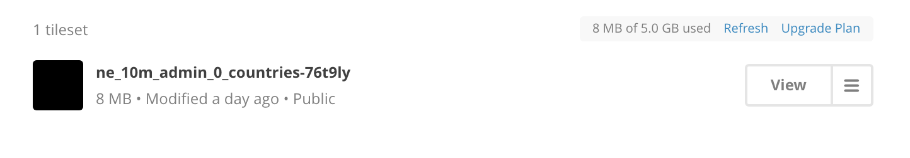
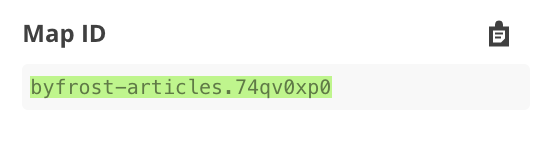
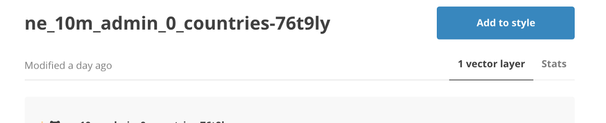

For a recent project, we needed to create a dynamic map that highlighted the areas in
which our client had done work. After evaluating the requirements and looking into our
options, we decided to build this using [Mapbox](http://mapbox.com/). Their integration
with [OpenStreetMap](https://www.openstreetmap.org/) and ability to easily customize the
tilesets and style on our map was an instant hook.

Let’s see what we’re building.

<iframe
  height="500"
  style="width: 100%;"
  scrolling="no"
  title="Mapbox Post - Final Result"
  src="//codepen.io/wuz/embed/ayOwjY/?height=500&theme-id=light&default-tab=result"
  frameborder="no"
  allowtransparency="true"
  allowfullscreen="true"
>
  See the Pen{' '}
  <a href="https://codepen.io/wuz/pen/ayOwjY/">Mapbox Post - Final Result</a> by
  Conlin Durbin (<a href="https://codepen.io/wuz">@wuz</a>) on{' '}
  <a href="https://codepen.io">CodePen</a>.
</iframe>

In this example, we are going to create a pop up that shows some basic stats about the
country. This method can be used for any kind of Mapbox tileset, but we we using data
from [Natural Earth Data](http://www.naturalearthdata.com/downloads/10m-cultural-vectors/). Below is a link for the vector tileset we are using. Click
the download countries link on that page and let’s get started!



To begin building, you’ll need to create a [Mapbox Studio account](http://mapbox.com/studio).
Once you get signed up, you’ll need to get your API access token. Login to your Mapbox
account and click into the Account button on the bottom left of dashboard. Then on API
access tokens on the top right. Look for your Default Public Token.

> The next couple steps assume that you are using local files to run this code.
> If you want to play around with it in Codepen, [here is a quick template](https://codepen.io/wuz/pen/Mvaavy?editors=0010)
> that has the start of the project.

Go ahead and copy then paste it into a new Javascript file named `main.js` like this:

```js
mapboxgl.accessToken =
  'pk.eyJ1IjoiYnlmcm9zdC1hcnRpY2xlcyIsImEiOiJjajVsZ3NwZGczMWNtMnFyeTR2cHRnajZ4In0.HOjYrueiLWlhLfhsDCa7wQ'; // Replace with your token
```

Now we just need some basic HTML boilerplate. Create a file called index.html and add the following:

```html
<!DOCTYPE html>
<html>
  <head>
    <title>My Awesome Map</title>
    <link rel="stylesheet" href="style.css" />
  </head>
  <body>
    <div id="map"></div>
    <script src="https://api.mapbox.com/mapbox-gl-js/v0.38.0/mapbox-gl.js"></script>
    <script src="main.js"></script>
  </body>
</html>
```

Now let’s add some styles. Create a style.css and add this:

```css
#map {
  height: 500px;
  width: 1000px;
}
#map .mapboxgl-popup-content {
  padding: 10px;
  max-width: 300px;
  padding-top: 20px;
}
#map .mapboxgl-popup-content ul {
  list-style: none;
  margin: 0;
  padding: 0;
  float: left;
}

#map .mapboxgl-popup-content ul h3 {
  margin: 0 0 10px 0;
}

#map .mapboxgl-popup-content img {
  float: left;
  width: 30px;
  margin-right: 10px;
}
```

If you load up your page, you probably won’t see anything yet. Our next step is to add a map. Add the following code to main.js:

```js
mapboxgl.accessToken =
  'pk.eyJ1IjoiYnlmcm9zdC1hcnRpY2xlcyIsImEiOiJjajVsZ3NwZGczMWNtMnFyeTR2cHRnajZ4In0.HOjYrueiLWlhLfhsDCa7wQ'; // Replace with your token

var map = new mapboxgl.Map({
  container: 'map', //this is the id of the container you want your map in
  style: 'mapbox://styles/mapbox/light-v9', // this controls the style of the map. Want to see more? Try changing 'light' to 'simple'.
  minZoom: 2, // We want our map to start out pretty zoomed in to start.
});
```

> If you used the Codepen template from above, you should already have everything up to this point.

<iframe
  height="500"
  style="width: 100%;"
  scrolling="no"
  title="Mapbox Post - Starting Out"
  src="//codepen.io/wuz/embed/NvGGjQ/?height=500&theme-id=light&default-tab=js,result"
  frameborder="no"
  allowtransparency="true"
  allowfullscreen="true"
>
  See the Pen{' '}
  <a href="https://codepen.io/wuz/pen/NvGGjQ/">Mapbox Post - Starting Out</a> by
  Conlin Durbin (<a href="https://codepen.io/wuz">@wuz</a>) on{' '}
  <a href="https://codepen.io">CodePen</a>.
</iframe>

At this point, we need to load in our custom tileset in Mapbox Studio. If you haven’t already, download the Natural Earth Data from earlier. Open Mapbox Studio and click on Tilesets. From there click on “New tileset”



Upload the entire zip file you downloaded from Natural Earth Data.



Wait for it to finish uploading and processing.



Once it’s done, click into your custom tileset.



We need to load this custom tileset into your map now. We create a function on map load. Create a custom event listener and call addLayer inside it.

<figure>



  <figcaption>Copy your map ID</figcaption>
</figure>

Look for the Map ID on the right hand side bar.

<figure>



  <figcaption>Copy the name starting with ne_</figcaption>
</figure>

You’ll also need the source layer name, which is that bit starting with `ne_`. Grab this and the Map ID and add them to your JS code.

```js
mapboxgl.accessToken =
  'pk.eyJ1IjoiYnlmcm9zdC1hcnRpY2xlcyIsImEiOiJjajVsZ3NwZGczMWNtMnFyeTR2cHRnajZ4In0.HOjYrueiLWlhLfhsDCa7wQ'; // Replace with your token

var map = new mapboxgl.Map({
  container: 'map', //this is the id of the container you want your map in
  style: 'mapbox://styles/mapbox/light-v9', // this controls the style of the map. Want to see more? Try changing 'light' to 'simple'.
  minZoom: 2, // We want our map to start out pretty zoomed in to start.
});

map.on('load', function() {
  //On map load, we want to do some stuff
  map.addLayer({
    //here we are adding a layer containing the tileset we just uploaded
    id: 'countries', //this is the name of our layer, which we will need later
    source: {
      type: 'vector',
      url: 'mapbox://', // <--- Add the Map ID you copied here
    },
    'source-layer': '', // <--- Add the source layer name you copied here
    type: 'fill',
    paint: {
      'fill-color': '#52489C', //this is the color you want your tileset to have (I used a nice purple color)
      'fill-outline-color': '#F2F2F2', //this helps us distinguish individual countries a bit better by giving them an outline
    },
  });
});
```

We should now have loaded the tileset and your map should look something like this:

<iframe
  height="500"
  style="width: 100%;"
  scrolling="no"
  title="Mapbox Post - Tileset Added"
  src="//codepen.io/wuz/embed/WEQQav/?height=500&theme-id=light&default-tab=js,result"
  frameborder="no"
  allowtransparency="true"
  allowfullscreen="true"
>
  See the Pen{' '}
  <a href="https://codepen.io/wuz/pen/WEQQav/">Mapbox Post - Tileset Added</a>{' '}
  by Conlin Durbin (<a href="https://codepen.io/wuz">@wuz</a>) on{' '}
  <a href="https://codepen.io">CodePen</a>.
</iframe>

Right now this isn’t super helpful. All of the countries are showing, which makes it hard to distinguish anything. Let’s filter the data a bit.

For this, we want to filter by [ISO Alpha3 Codes](http://www.nationsonline.org/oneworld/country_code_list.htm), which exist in our tileset under the ID “ADM0_A3_IS”.

We add a line to the load function to start filtering:

```js
mapboxgl.accessToken =
  'pk.eyJ1IjoiYnlmcm9zdC1hcnRpY2xlcyIsImEiOiJjajVsZ3NwZGczMWNtMnFyeTR2cHRnajZ4In0.HOjYrueiLWlhLfhsDCa7wQ'; // Replace with your token

var map = new mapboxgl.Map({
  container: 'map', //this is the id of the container you want your map in
  style: 'mapbox://styles/mapbox/light-v9', // this controls the style of the map. Want to see more? Try changing 'light' to 'simple'.
  minZoom: 2, // We want our map to start out pretty zoomed in to start.
});

map.on('load', function() {
  //On map load, we want to do some stuff
  map.addLayer({
    //here we are adding a layer containing the tileset we just uploaded
    id: 'countries', //this is the name of our layer, which we will need later
    source: {
      type: 'vector',
      url: 'mapbox://', // <--- Add the Map ID you copied here
    },
    'source-layer': '', // <--- Add the source layer name you copied here
    type: 'fill',
    paint: {
      'fill-color': '#52489C', //this is the color you want your tileset to have (I used a nice purple color)
      'fill-outline-color': '#F2F2F2', //this helps us distinguish individual countries a bit better by giving them an outline
    },
  });

  map.setFilter(
    'countries',
    ['in', 'ADM0_A3_IS'].concat(['USA', 'AUS', 'NGA']),
  ); // This line lets us filter by country codes.
});
```

<iframe
  height="500"
  style="width: 100%;"
  scrolling="no"
  title="Mapbox Post - Filtered"
  src="//codepen.io/wuz/embed/RZWWEv/?height=500&theme-id=light&default-tab=js,result"
  frameborder="no"
  allowtransparency="true"
  allowfullscreen="true"
>
  See the Pen{' '}
  <a href="https://codepen.io/wuz/pen/RZWWEv/">Mapbox Post - Filtered</a> by
  Conlin Durbin (<a href="https://codepen.io/wuz">@wuz</a>) on{' '}
  <a href="https://codepen.io">CodePen</a>.
</iframe>

Much better. Now our map highlights three countries: Nigeria, Australia, and the USA. If we want to add more countries, we can just edit the array of country codes. We could even pull these codes from an API and add them that way.

Finally, let’s make the map interactive. For this, we are going to use the API provided by [REST Countries](https://restcountries.eu/). Luckily, they have an endpoint that accepts ISO Alpha3 codes!

```js
mapboxgl.accessToken =
  'pk.eyJ1IjoiYnlmcm9zdC1hcnRpY2xlcyIsImEiOiJjajVsZ3NwZGczMWNtMnFyeTR2cHRnajZ4In0.HOjYrueiLWlhLfhsDCa7wQ'; // Replace with your token

var map = new mapboxgl.Map({
  container: 'map', //this is the id of the container you want your map in
  style: 'mapbox://styles/mapbox/light-v9', // this controls the style of the map. Want to see more? Try changing 'light' to 'simple'.
  minZoom: 2, // We want our map to start out pretty zoomed in to start.
});

map.on('load', function() {
  //On map load, we want to do some stuff
  map.addLayer({
    //here we are adding a layer containing the tileset we just uploaded
    id: 'countries', //this is the name of our layer, which we will need later
    source: {
      type: 'vector',
      url: 'mapbox://byfrost-articles.74qv0xp0', // <--- Add the Map ID you copied here
    },
    'source-layer': 'ne_10m_admin_0_countries-76t9ly', // <--- Add the source layer name you copied here
    type: 'fill',
    paint: {
      'fill-color': '#52489C', //this is the color you want your tileset to have (I used a nice purple color)
      'fill-outline-color': '#F2F2F2', //this helps us distinguish individual countries a bit better by giving them an outline
    },
  });

  map.setFilter(
    'countries',
    ['in', 'ADM0_A3_IS'].concat(['USA', 'AUS', 'NGA']),
  ); // This line lets us filter by country codes.

  map.on('click', 'countries', function(mapElement) {
    const countryCode = mapElement.features[0].properties.ADM0_A3_IS; // Grab the country code from the map properties.

    fetch(`https://restcountries.eu/rest/v2/alpha/${countryCode}`) // Using tempalate tags to create the API request
      .then(data => data.json()) //fetch returns an object with a .json() method, which returns a promise
      .then(country => {
        //country contains the data from the API request
        // Let's build our HTML in a template tag
        const html = ` 
         
        <ul>
          <li><h3>${country.name}</h3></li>
          <li><strong>Currencies:</strong> ${country.currencies
            .map(c => c.code)
            .join(', ')}</li>
          <li><strong>Capital:</strong> ${country.capital}</li>
          <li><strong>Population:</strong> ${country.population}</li>
          <li><strong>Demonym:</strong> ${country.demonym}</li>
        </ul>
      `; // Now we have a good looking popup HTML segment.
        new mapboxgl.Popup() //Create a new popup
          .setLngLat(mapElement.lngLat) // Set where we want it to appear (where we clicked)
          .setHTML(html) // Add the HTML we just made to the popup
          .addTo(map); // Add the popup to the map
      });
  });
});
```

Now we have an interactive map with highlighted countries!

<iframe
  height="500"
  style="width: 100%;"
  scrolling="no"
  title="Mapbox Post - Final Result"
  src="//codepen.io/wuz/embed/ayOwjY/?height=500&theme-id=light&default-tab=js,result"
  frameborder="no"
  allowtransparency="true"
  allowfullscreen="true"
>
  See the Pen{' '}
  <a href="https://codepen.io/wuz/pen/ayOwjY/">Mapbox Post - Final Result</a> by
  Conlin Durbin (<a href="https://codepen.io/wuz">@wuz</a>) on{' '}
  <a href="https://codepen.io">CodePen</a>.
</iframe>
